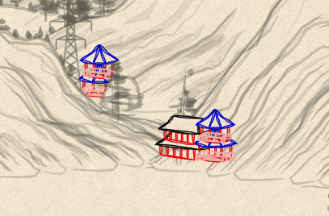

# {Shan, Shui}\*

Procedurally-understandably-generated vector-format infinitely-scrolling Chinese landscape for the browser.
This is a newer version of [RedContritio's](https://github.com/RedContritio) [app](https://github.com/RedContritio/shan_shui_inf) based on original code from [{Shan, Shui}\*](https://github.com/LingDong-/shan-shui-inf/blob/master/README.md#shan-shui) coded by [Lingdong Huang](https://github.com/LingDong-). This version is build on React 18 with less dependecies.

Documentation can be seen [here](https://htmlpreview.github.io/?https://github.com/Megaemce/shan_shui/blob/main/docs/index.html)

## Components

### generateMan

### water

### architecture

#### GenerateArch01

green - `generateHut`

red - `generateBox`

pink - `generateRail`

#### GenerateArch02

black - `generateDeco`

red - `generateBox`

#### generateArch03

blue - `generatePagodaRoof`

red - `generateBox`

pink - `generateRail`

#### generateArch04

blue - `generatePagodaRoof`

red - `generateBox`

pink - `generateRail`

#### generateBoat

#### generateTransmissionTower

### tree

#### generateTree01

#### generateTree02

#### generateTree03

#### generateTree04

#### generateTree05

#### generateTree06

#### generateTree07

#### generateTree08

### mountain

#### generateMountain

#### generateFlatMountain

#### generateDistantMountain

